# Mangwale AI - Web Chat Flow Architecture

## 🎯 Overview
This document visualizes how messages flow through the **multi-channel orchestrator architecture** focusing on the **web chat interface** at `chat.mangwale.ai/chat`.

---

## 📊 Complete System Flow


---

## 🔍 Web Chat Specific Flow (Detailed)

```mermaid
sequenceDiagram
    participant User as 👤 User<br/>chat.mangwale.ai/chat
    participant Web as 🌐 Web Client<br/>(React/Next.js)
    participant API as 🎯 ChatWebController<br/>/agents/chat
    participant Conv as 🧠 ConversationService
    participant Sess as 💾 SessionService<br/>(Redis)
    participant Orch as 🤖 AgentOrchestrator
    participant NLU as 📊 NLU Classifier
    participant Agent as 🎭 SearchAgent
    participant Func as ⚙️ FunctionExecutor
    participant Search as 🔍 SearchAPI<br/>(OpenSearch)
    participant Logger as 📝 ConversationLogger
    participant DB as 🗄️ PostgreSQL

    User->>Web: Types "Find chicken pizza near me"
    Web->>API: POST /agents/chat<br/>{message, userId, channel: 'web'}
    
    API->>Conv: handleMessage(userId, message)
    Conv->>Sess: getOrCreate(userId)
    Sess->>Redis: GET session:userId
    Redis-->>Sess: {step: null, data: {}}
    Sess-->>Conv: Session object
    
    Conv->>Orch: processMessage(message, context)
    Orch->>NLU: classify(message)
    NLU-->>Orch: {intent: 'search_food', confidence: 0.82}
    
    Orch->>Agent: process(message, context)
    Note over Agent: Agent calls LLM with functions:<br/>- search_products<br/>- get_location
    
    Agent->>Func: execute('search_products', {query: 'chicken pizza'})
    Func->>Search: POST /search<br/>{query, type: 'food', location}
    Search-->>Func: [{name: 'Chicken BBQ Pizza',...}]
    Func-->>Agent: Search results
    
    Agent-->>Orch: "Found 5 pizza options!"
    Orch->>Sess: update({step: 'viewing_results'})
    Sess->>Redis: SET session:userId
    
    Orch-->>Conv: Response with product cards
    Conv->>Logger: log(userId, message, response)
    Logger->>DB: INSERT INTO conversation_logs
    
    Conv-->>API: {reply, products: [...]}
    API-->>Web: JSON response
    Web-->>User: Shows pizza cards with prices
    
    Note over Logger,DB: 🎓 Logged for future training<br/>Target: 500-1000 samples<br/>Current: ~122 samples
```



---

## 🎯 Current State vs Target

### **Current NLU Performance**
- **Model**: IndicBERTv3_final (ai4bharat/IndicBERTv2-MLM-Back-TLM)
- **Accuracy**: 48% (122 training samples, 13 intents)
- **Status**: 🔴 Below production threshold

### **Target Performance**
- **Accuracy**: 75-80% (gold standard)
- **Required**: 500-1000 real conversation samples
- **Timeline**: 2-4 weeks with beta users
- **Method**: Web chat data collection → Label Studio → Retrain

### **Data Collection Strategy**
1. **Source**: Real users on `chat.mangwale.ai/chat`
2. **Logging**: Every conversation → PostgreSQL `conversation_logs`
3. **Annotation**: Export to Label Studio weekly
4. **Training**: GPU batch training every 100 new samples
5. **Deployment**: Continuous model updates via model registry

---

## 🚀 Key Components

### **1. ChatWebController** (`src/agents/controllers/chat-web.controller.ts`)
- **Purpose**: REST API for web chat
- **Endpoint**: `POST /agents/chat`
- **Features**:
  - CORS enabled for web client
  - Session-aware (userId tracking)
  - Message history support
  - Real-time response streaming (optional)

### **2. ConversationService** (`src/conversation/conversation.service.ts`)
- **Purpose**: Channel-agnostic conversation orchestration
- **Responsibilities**:
  - Session management (get/create/update)
  - Route messages to appropriate handlers
  - Multi-channel message formatting
  - Conversation logging trigger

### **3. AgentOrchestratorService** (`src/agents/services/agent-orchestrator.service.ts`)
- **Purpose**: Intelligent agent selection and coordination
- **Flow**:
  1. Receive message + context
  2. Call NLU classifier (IndicBERT)
  3. Map intent → agent (IntentRouter)
  4. Execute agent with function calling
  5. Return formatted response

### **4. NLU Classifier** (`src/nlu/services/nlu-classification.service.ts`)
- **Model**: IndicBERT v3 (278M parameters)
- **Input**: User message (any language)
- **Output**: `{intent: string, confidence: number}`
- **Intents**: 13 categories (search_food, track_order, etc.)

### **5. Specialized Agents** (`src/agents/agents/*.agent.ts`)
- **FAQAgent**: Greetings, help, general questions
- **SearchAgent**: Product/service discovery (food, ecom, services)
- **OrderAgent**: Order tracking, cancellation, status
- - **ComplaintsAgent**: Refunds, issues, disputes
- **BookingAgent**: Rides, rooms, appointments

### **6. FunctionExecutorService** (`src/agents/services/function-executor.service.ts`)
- **Purpose**: Execute agent function calls
- **Functions** (14 total):
  - `search_products` → OpenSearch API
  - `check_order_status` → PHP Backend
  - `calculate_parcel_cost` → PHP Integration
  - `get_user_location` → Session/PHP
  - `book_ride` → PHP Backend
  - ... and 9 more

### **7. ConversationLoggerService** (`src/database/conversation-logger.service.ts`)
- **Purpose**: Log every conversation for training
- **Schema**:
  ```sql
  conversation_logs (
    id, userId, channelId, message, 
    response, intent, confidence, 
    createdAt, metadata
  )
  ```
- **Usage**: Export to Label Studio → Annotate → Retrain NLU

---

## 🔄 Training Pipeline (Next Steps)


### **Steps to Enable**
1. ✅ **Application Running** (port 3200)
2. ✅ **Redis Connected** (port 6381)
3. ✅ **ConversationLogger Active** (PostgreSQL)
4. 🔄 **Test Web Chat** (send test message)
5. 🔄 **Verify Logging** (check conversation_logs table)
6. 🔄 **Invite Beta Users** (50-100 users)
7. 📅 **Collect Data** (2-4 weeks → 500 samples)
8. 📊 **Label in Studio** (weekly batches)
9. 🎓 **Retrain Model** (every 100 samples)
10. 🚀 **Deploy & Monitor** (track accuracy improvement)

---

## 🧪 Testing Web Chat Flow

### **1. Send Test Message**
```bash
curl -X POST http://localhost:3200/agents/chat \
  -H 'Content-Type: application/json' \
  -d '{
    "userId": "test_user_001",
    "message": "Hi, can you help me find pizza restaurants?",
    "channel": "web"
  }'
```

### **2. Verify Conversation Logging**
```sql
SELECT 
  id, 
  "userId", 
  message, 
  response, 
  intent, 
  confidence,
  "createdAt"
FROM conversation_logs 
WHERE "userId" = 'test_user_001'
ORDER BY "createdAt" DESC
LIMIT 10;
```

### **3. Check Session State**
```bash
redis-cli -p 6381 GET session:test_user_001
```

### **4. Monitor Agent Selection**
```bash
pm2 logs mangwale-ai --lines 50 | grep "Agent selected"
```

---

## 📈 Success Metrics

### **Phase 1: Data Collection (Weeks 1-2)**
- ✅ 100 unique users on web chat
- ✅ 300 conversations logged
- ✅ 80% logging success rate
- ✅ Average 3 messages per conversation

### **Phase 2: Annotation (Weeks 2-3)**
- ✅ 250 conversations labeled in Label Studio
- ✅ Inter-annotator agreement > 85%
- ✅ All 13 intents represented
- ✅ Balanced intent distribution (±20%)

### **Phase 3: Retraining (Week 3)**
- ✅ Model accuracy: 48% → 65-70%
- ✅ GPU training time: < 5 minutes
- ✅ Zero downtime deployment
- ✅ Confidence scores > 0.7 for 80% of predictions

### **Phase 4: Production (Week 4+)**
- ✅ Model accuracy: 70% → 75-80%
- ✅ Continuous data collection (500/month)
- ✅ Monthly model updates
- ✅ A/B testing for new intents

---

## 🎓 Key Insights

1. **Multi-Channel Architecture**: Same conversation logic works across WhatsApp, Telegram, and Web
2. **Agent Orchestrator**: Intelligent routing based on NLU classification
3. **Function Calling**: Agents dynamically call 14+ functions for real-world actions
4. **Data-Driven Training**: Real conversations > gamification for NLU training
5. **Session Management**: Redis for fast state, PostgreSQL for persistence
6. **Headless Orchestration**: NestJS handles conversations, PHP handles business logic

---

## 🔗 Related Documentation
- [AGENT_SYSTEM_COMPLETE.md](./AGENT_SYSTEM_COMPLETE.md) - Full agent architecture
- [COMPLETE_FLOW_SYSTEM_ALL_TASKS_DONE.md](./COMPLETE_FLOW_SYSTEM_ALL_TASKS_DONE.md) - Flow engine
- [GAMIFICATION_STATUS_AND_NEXT_STEPS.md](./GAMIFICATION_STATUS_AND_NEXT_STEPS.md) - Training strategy
- [SESSION_SUMMARY.md](./SESSION_SUMMARY.md) - Session decisions log

---

**Last Updated**: 2025-11-18  
**Status**: ✅ Application Deployed (port 3200)  
**Next Action**: Test web chat + Start data collection
